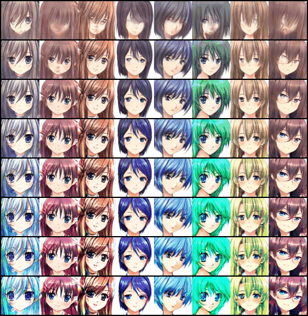

# SNGAN on Anime Face Dataset
> This repo provides an unofficial PyTorch Implementation of Spectral Normalization for Generative Adversarial Networks (SNGAN)[^1] with specialization in Anime faces[^2] generation.

## Roadmap
- [x] original SNGAN
  - [x] differentiable power iteration
  - [x] $\gamma$-reparameterization
  - [x] ResNet architecture
  - [x] hinge loss [^3]
- [x] dataset-specific tuning
  - [x] set $n_{dis} = 1$ 
  - [x] use 1x1 conv instead of 3x3 conv for penultimate layer of G
  - [x] replace `avgpool2d` down-sampling with stride-2 conv
- [x] TTUR[^4]
- [x] mixed precision (-**11%** time)[^5]
- [x] cuDNN benchmark
- [ ] ~~FID metrics + precomputed statistics~~
   - InceptionV3 pretrained on ImageNet is not suitable for anime data
   - data-specific feature extractor is needed

- [x] exponential moving average
- [x] visualizations :smile:

## Anime face generation
### Generations from fixed noise

*evolving over 50 training epochs*

### Walk in the latent space

### Interpolation

### Truncation effect

*from top to bottom: the variance varies from 0.3 to 3 cubically*

## References

---

[^1]: Miyato, Takeru, et al. "Spectral Normalization for Generative Adversarial Networks." *International Conference on Learning Representations*. 2018.
[^2]: Chao, Brian. ‘Anime Face Dataset: a collection of high-quality anime faces’. *GitHub*, https://github.com/bchao1/Anime-Face-Dataset.
[^3]: Lim, Jae Hyun, and Jong Chul Ye. "Geometric gan." *arXiv preprint arXiv:1705.02894* (2017).
[^4]: Heusel, Martin, et al. "Gans trained by a two time-scale update rule converge to a local nash equilibrium." *Advances in neural information processing systems* 30 (2017).
[^5]: "Automatic Mixed Precision For Deep Learning". *NVIDIA Developer*, https://developer.nvidia.com/automatic-mixed-precision.

