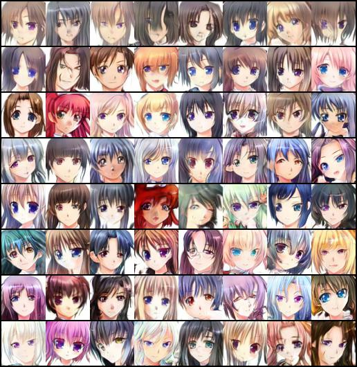
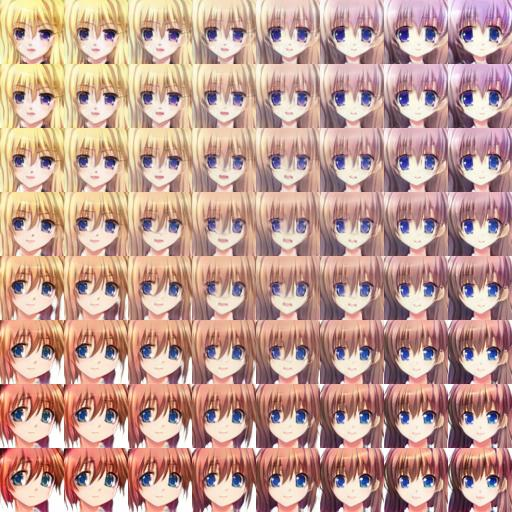

# SNGAN on Anime Face Dataset
> This repo provides an unofficial PyTorch Implementation of Spectral Normalization for Generative Adversarial Networks (SNGAN)[^1] with specialization in Anime faces generation.

## Roadmap
- [x] original SNGAN
  - [x] differentiable power iteration
  - [x] $\gamma$-reparameterization
  - [x] ResNet architecture
  - [x] hinge loss [^2]

- [x] dataset-specific tuning
  - [x] set $n_{dis} = 1$ 
  - [x] use 1x1 conv instead of 3x3 conv for penultimate layer of G
  - [x] replace `avgpool2d` down-sampling with stride-2 conv

- [x] TTUR[^3]
- [x] mixed precision (-**11%** time)[^4]
- [x] cuDNN benchmark
- [ ] FID metrics + precomputed statistics

## Anime face generation
### Training process

### Truncation effect

*from top to bottom: the variance varies from 0.3 to 2 linearly*

### Interpolation

## References

---

[^1]: Miyato, Takeru, et al. "Spectral Normalization for Generative Adversarial Networks." *International Conference on Learning Representations*. 2018.
[^2]: Lim, Jae Hyun, and Jong Chul Ye. "Geometric gan." *arXiv preprint arXiv:1705.02894* (2017).
[^3]: Heusel, Martin, et al. "Gans trained by a two time-scale update rule converge to a local nash equilibrium." *Advances in neural information processing systems* 30 (2017).
[^4]: "Automatic Mixed Precision For Deep Learning". *NVIDIA Developer*, https://developer.nvidia.com/automatic-mixed-precision.

